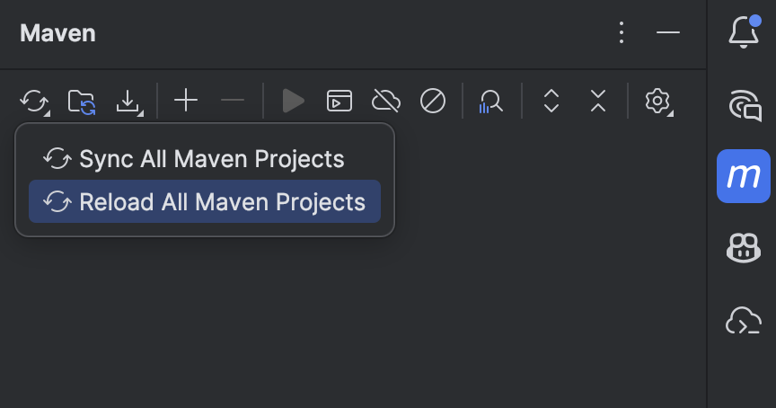
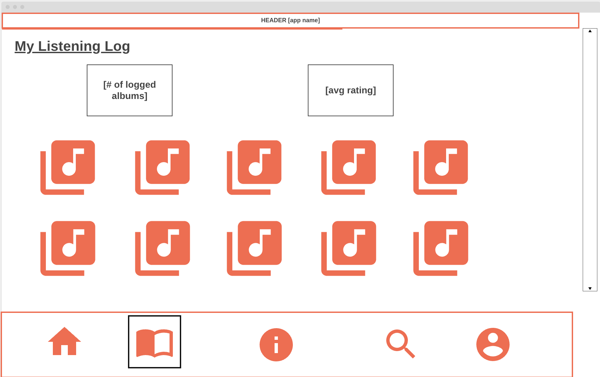
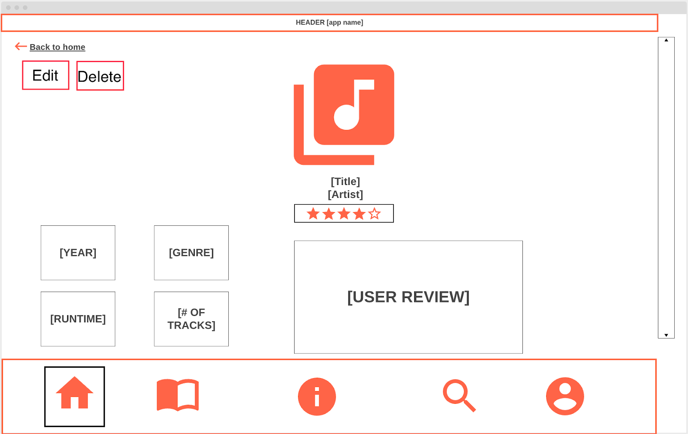
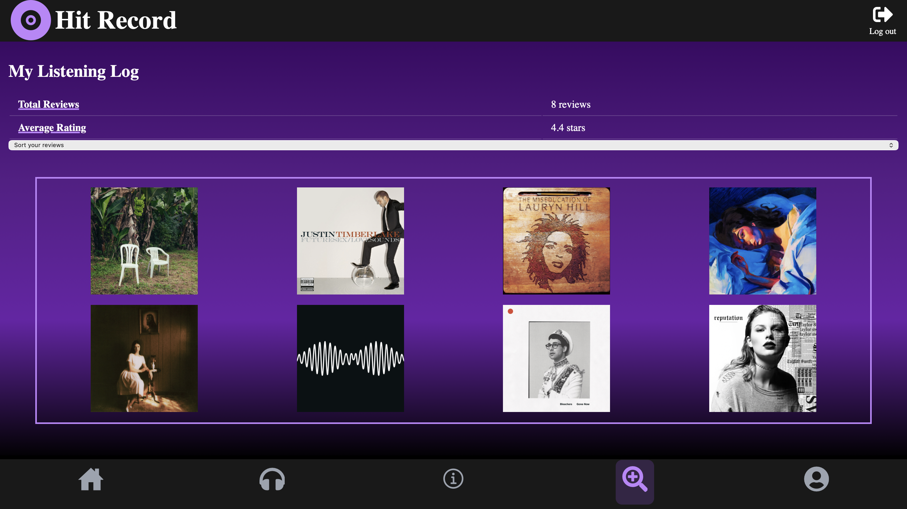
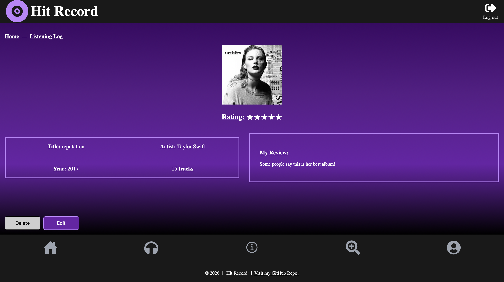
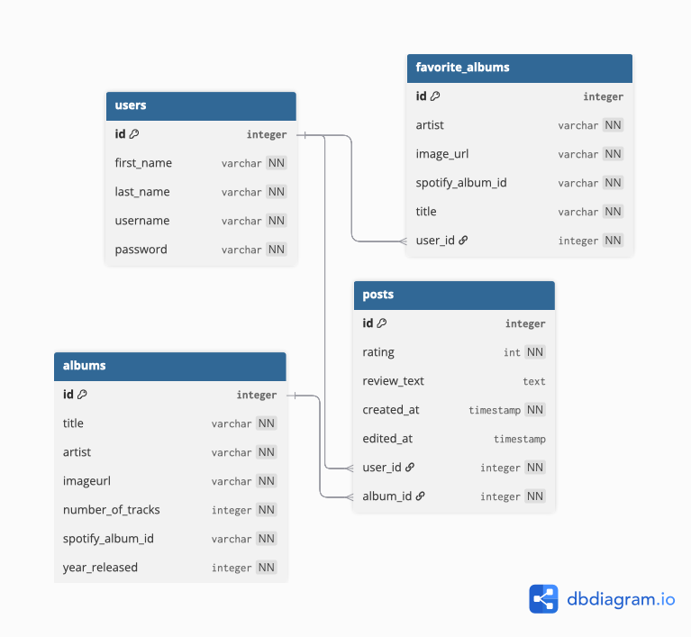

# 🎵 Hit Record


**Hit Record** is the platform every music-lover-turned-critic has been dreaming of. For years, music fans have taken to social media and online forums to discuss their thoughts on their favorite artist’s latest projects, but until now there has not been a platform solely dedicated to music reviews.

With Hit Record, anyone can register for an account, search for an album, and start writing reviews. Using a connection to the **Spotify Web API**, the application returns album search results and allows users to select an album, assign a rating from 1–5, and write a full review.

As users submit more reviews, they can revisit and organize them in their **Listening Log**, where they can also **edit or delete posts**. Users can additionally highlight **up to four favorite albums** on their profile page to showcase their music taste.

With **Hit Record**, everyone’s a critic.

---

## 🛠 Technologies Used

### Frontend
    

### Backend
 

### Database


### APIs


---

## 💻 Installation Instructions

Follow these steps to run **Hit Record locally**.

### Install Required Software

Ensure the following tools are installed:

| Tool | Purpose |
|-----|-----|
| VS Code | Frontend development |
| IntelliJ IDEA CE | Backend development |
| MySQL Workbench | Database management |
| Node.js + npm | Frontend dependencies |

---

## 🗄 Database Setup

Install **MySQL Workbench** and create the schema:

```sql
CREATE SCHEMA hit_record_database;
```
and **select the created schema**.

---

## 🎧 Spotify API Setup

Visit the [Spotify Developer Dashboard](https://developer.spotify.com) and receive:

- Client ID
- Client Secret

These credentials will be used in your **frontend environment variables** to make API calls for your album searches.

---

## 📥 Clone the Repository

Fork the [Hit Record GitHub repository](https://github.com/kantojoey/Unit2-Final-AlexisT) and **clone it to your local machine** in the terminal:
`git clone [forked url]`

---

## ⚛️ Frontend Setup
Open the `hit-record-frontend` folder in **VS Code**.

Install dependencies in the terminal:
`npm install`

Create a .env file in the root of the frontend project and add:
```
VITE_CLIENT_ID=[YOUR_API_ID]
VITE_CLIENT_SECRET=[YOUR_API_SECRET]
```
Inside `App.jsx`, **after the import statements**, access the variables:
```
const clientID = import.meta.env.VITE_CLIENT_ID;
const clientSecret = import.meta.env.VITE_CLIENT_SECRET;
```

---

## 💾 Backend Setup
Open the `hit-record-backend` folder in **IntelliJ IDEA**.

Use the Maven toolbar to select **Reload All Maven Projects**.


Navigate to:

`src/main/resources/application.properties`

Add your database credentials:
```
spring.datasource.username=root
spring.datasource.password=
```

🔀 **Replace these values with your MySQL username and password if needed**.

▶️ **Run** the backend application:
`HitRecordBackendApplication`

---

## 🧪 Verify Database

After starting the backend, check MySQL Workbench to confirm the following tables were created:

| Tables |
|------|
| users |
| posts |
| albums |
| favorite_albums |

---

## 🚀 Running the Application

In **VS Code**, use the terminal to start the frontend development server:
`npm run dev`

*Your application will typically run at:*
`http://localhost:5173/`

**Once the application loads** you can:

- Click Sign Up
- Create an account
- Begin searching for albums and writing reviews

---

# 🧩 Digital Wireframes

The full digital wireframes can be accessed [here](https://docs.google.com/presentation/d/1_-wyno7tldrfjAPZcXQE9ahP6VV-s67o2E3DCD9ZgXA/edit?usp=sharing).

A preview of the wireframe and final production versions of Hit Record are available below:

*Wireframe*





*Final Production*





---

# 🗂 Entity Relationship Diagram (ERD)
*View and interact with the complete ERD [here](https://dbdiagram.io/d/Hit-Record-699275c3bd82f5fce2c76321)*.



---

# 🚧 Future Features ➡️

*Potential improvements for future versions:*

📋 **Listening Log Improvements**
- Apply multiple filters simultaneously
- Custom filtering by rating, artist, release year, or date reviewed

🤳 **Social Features**
- Follow other users
- View other users’ listening logs
- Like and comment on album reviews

💿 **Album List Collections**
- Create themed album collections
- Pin collections to user profiles

🔐 **Security Improvements**
- Implement Spring Security
- Add password hashing
- Implement JWT authentication
- Deploy the application to a cloud hosting platform
